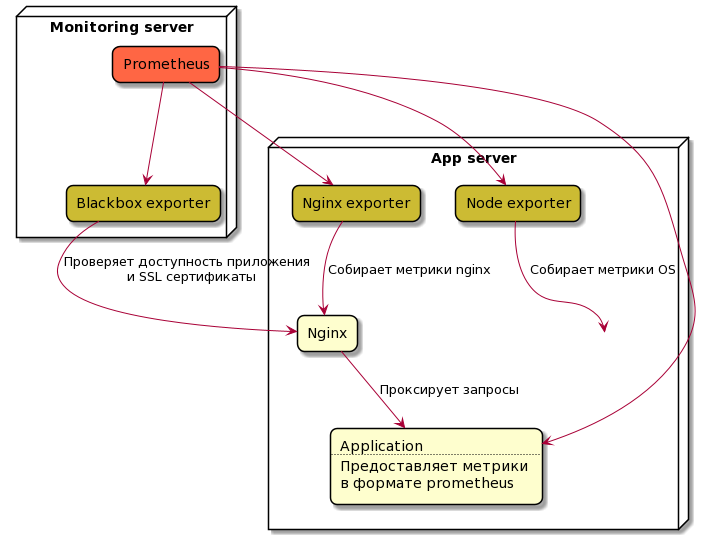

О том как собирал мониторинговую инфраструктуру.

<!--more-->

Чего хотел:

- мониторить сервисы, инфраструктуру, доступность api/сайта
- смотреть с телефона
- ошибки прилетали в Telegram

Очевидным показался выбор SaaS-ов ([Datadog](https://www.datadoghq.com), [Dynatrace](https://www.dynatrace.com), [New Relic](https://newrelic.com)). У них есть бесплатные варианты, но не хотелось следить за квотами, а потом платить деньги за случайно включенный debug на сервисе (словил флешбеки при использовании Amazon RDS). Хотелось, чтобы цена ошибки была минимальной. Из этого появилось новое требование:

- влезало на минимальный сервер [Linode](https://www.linode.com)

Остался опенсорс, для простого приключения взял то с чем уже был опыт и у чего больше всего звёздочек в гитхабе. Получилось так: 

- Prometheus
- Loki
- Grafana
- Exporters
- Promtail

## Как собирать

[Prometheus exporters](https://prometheus.io/docs/instrumenting/exporters/) - то, что будет собирать метрики и представлять в виде http эндпоинтов. Можно подобрать из [большого списка](https://prometheus.io/docs/instrumenting/exporters/). Какие использовал:

- [nginx_exporter](https://github.com/nginxinc/nginx-prometheus-exporter) - проверяет жив ли nginx и какая на нем нагрузка
- [blackbox_exporter](https://github.com/prometheus/blackbox_exporter) - ходит на указанные хосты, проверяет что они живы и их ssl сертификаты
- [node_exporter](https://github.com/prometheus/node_exporter) - метрики операционной системы

Также метрики можно отдавать напрямую с разработанных сервисов в формате prometheus. Для этого есть [prometheus библиотеки](https://prometheus.io/docs/instrumenting/clientlibs/) или, если хочется гибкости, [фасады](https://micrometer.io/docs) которые абстрагируются от потребителя метрик, т.е. можно потом хоть в вышеупомянутые SaaS-ы загонять их.

Для логов взял [Promtail](https://grafana.com/docs/loki/latest/clients/promtail/), которому достаточно передать список файлов, за которыми надо следить.

## Как хранить

[Prometheus](https://prometheus.io) - БД метрик. По http ходит в экспортеры и сохраняет слепок метрик в привязке к текущему времени. По умолчанию хранит рядом с собой, но можно на [выделенных хранилищах](https://prometheus.io/docs/operating/integrations/#remote-endpoints-and-storage) таких как InfluxDB, или, если вы большой дядька, Kafka.

С логами схема обратная. Promtail собирает логи и отправляет их в [Loki](https://grafana.com/oss/loki/), который выступает в качестве БД. Также как и прометей может делегировать хранение в другие хранилища, например Cassandra или AWS S3.

Чтобы не забивать диски настроил [table manager](https://grafana.com/docs/loki/latest/operations/storage/table-manager/) подчищать логи каждые 7 дней. 

## Как визуализировать

Для красивых графиков (дашбордов) взял [Grafana](https://grafana.com), т.к. она отлично из коробки умеет работать как с Prometheus, так и с Loki. Приятно, что большая часть дашбордов уже готовы, не надо собирать самому. Например, дашборды [сервера](https://grafana.com/grafana/dashboards/1860), [JVM](https://grafana.com/grafana/dashboards/4701) и [Loki](https://grafana.com/grafana/dashboards/13407). 

С мобилки тоже работает:

## Как не проспать катастрофу

В Grafana в web ui набросал alert-ы и присоединил их к [Telegram-боту](https://gist.github.com/ilap/cb6d512694c3e4f2427f85e4caec8ad7). Просто и удобно.

## Что получилось

Grafana, Prometheus и Loki поместились на сервере 1 CPU/1 Gb RAM. Едят мало, на сервере остался хороший запас по ресурсам. Предвижу, что могут быть проблемы при увеличении количества логов и Loki придётся мигрировать на отдельный сервер. С Prometheus и Grafana могут начаться приколы, когда захочется строить графики за большие промежутки времени, но тут достаточно сделать строгие retention политики. 

Если хочется пощупать этот стек, то добрые люди выложили в интернетах [docker-compose](https://github.com/shadinua/demo-grafana-loki-prometheus/blob/master/docker-compose.yml).
